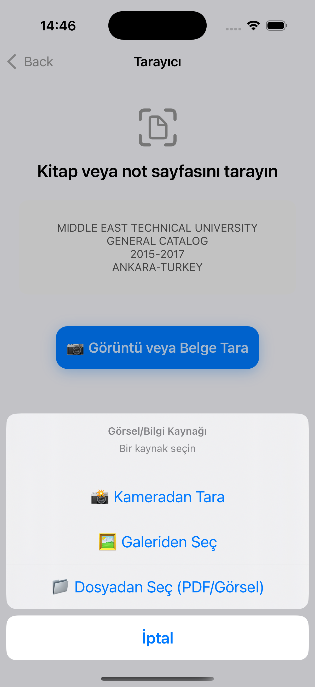

# 📄 AI Scan – Özet Çıkarıcı

**AI Scan**, kitap, ders notu, belge ve PDF'leri mobil cihazınızla tarayarak içeriğini yapay zeka destekli olarak otomatik özetleyen bir iOS uygulamasıdır.

Uygulama, Vision framework'ü ile OCR (optik karakter tanıma) yapar ve ardından metni anlamlandırarak kullanıcıya özet sunar.

---

## 🚀 Özellikler

- 📷 Kamera, galeri veya PDF'den belge tarama
- 🤖 OCR (Optik Karakter Tanıma) ile metin çıkarma
- 🧠 Yapay zeka destekli özet oluşturma
- 🗂 Son taranan belgeyi saklama ve geçmiş görüntüleme
- 🌍 TR / EN dil desteği (otomatik)
- 🧾 Kopyala, paylaş, yeniden özetle butonları
- 🎯 Temiz, modern ve sade kullanıcı arayüzü
- 💾 UserDefaults ile son özetin kalıcı saklanması

---

## 📸 Ekran Görüntüleri

### 📸 Özet Ekranı

### 📸 Tarama Seçenekleri Ekranı

## 🧱 Kullanılan Teknolojiler

| Framework / Araç | Açıklama |
|------------------|----------|
| `UIKit`          | Tüm kullanıcı arayüzü bileşenleri için |
| `Vision`         | Apple OCR (metin tanıma) işlemleri |
| `VisionKit`      | Kamera entegrasyonu |
| `AVFoundation`   | Kamera erişim izinleri |
| `UniformTypeIdentifiers` | PDF ve görsel dosya okuma |
| `UserDefaults`   | Son özetin kaydedilmesi |
| `OpenAI API` _(isteğe bağlı)_ | Özetleme için gelişmiş yapay zeka entegrasyonu |

---
